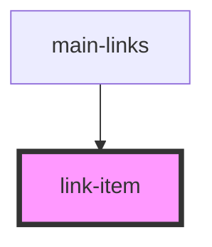

# link-item

<!-- Auto Generated Below -->

## Properties

| Property | Attribute | Description | Type     | Default     |
| -------- | --------- | ----------- | -------- | ----------- |
| `alt`    | `alt`     |             | `string` | `undefined` |
| `height` | `height`  |             | `number` | `undefined` |
| `icon`   | `icon`    |             | `string` | `undefined` |
| `link`   | `link`    |             | `string` | `undefined` |
| `name`   | `name`    |             | `string` | `undefined` |
| `width`  | `width`   |             | `number` | `undefined` |

## Dependencies

### Used by

 - [main-links](../main-links)

### Graph

----------------------------------------------

*Built with [StencilJS](https://stenciljs.com/)*
